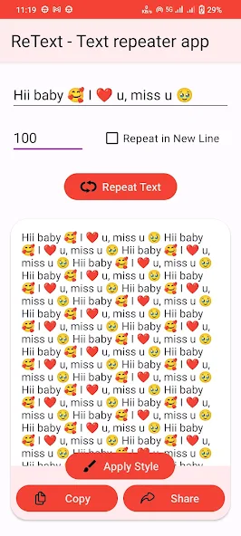
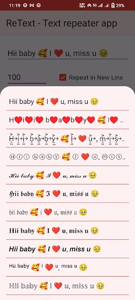
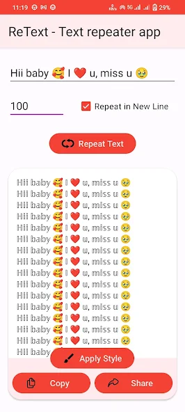
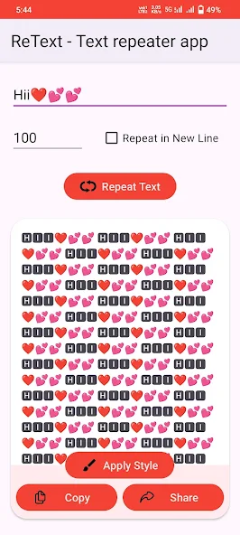
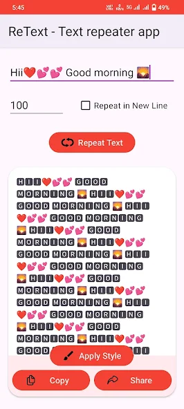
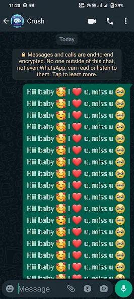

# Text Repeater : Repeat Text 10k 📄🔁

A simple, fast, and lightweight Android app to repeat text up to **10,000 times** instantly.  
Perfect for messaging apps, testing, formatting, and fun text generation.

👉 **Available on Google Play:**  
https://play.google.com/store/apps/details?id=com.dktechhub.retexter

---

## 📱 About the App

**Text Repeater : Repeat Text 10k** helps you generate repeated text quickly without limits or complexity.  
Enter your text, choose how many times you want it repeated, and copy or share the result instantly.

All processing happens **locally on your device** — no internet, no data collection.

---

## ✨ Features

- 🔁 Repeat text up to **10,000 times**
- ⚡ Instant output generation
- 📋 One-tap copy to clipboard
- 📤 Share repeated text easily
- 🧠 Simple & clean UI
- 🔒 No login required
- 🌐 Works **offline**
- 🚫 No ads (if applicable)
- 🛡️ No data collection

---

## 🔐 Privacy First

- ✅ No personal data collected
- ✅ No analytics or tracking
- ✅ No third-party SDKs
- ✅ Safe for children under 13

Read the full **Privacy Policy** here:  
👉 *[Add your GitHub Pages privacy policy link]*

---

## 📦 Installation

Download directly from the Google Play Store:

---

## 🖼️ Screenshots

<!-- Add screenshots here -->
<!-- Example:

-->

---

## 🛠️ Tech Stack

- Android (Java / Kotlin)
- Material UI
- No backend
- No database
- No network calls

---

## 🚀 Use Cases

- WhatsApp / Telegram message formatting
- Text testing & debugging
- Social media captions
- Fun & creative text generation
- Developer testing

---

## 📧 Contact

Developed by **Durgesh Kumar**

For feedback, issues, or suggestions:  
📩 **Email:** kdurgesh2004ee@gmail.com

---

## 📄 License

This project is provided for personal and educational use.  
All rights reserved © DKTechHub
